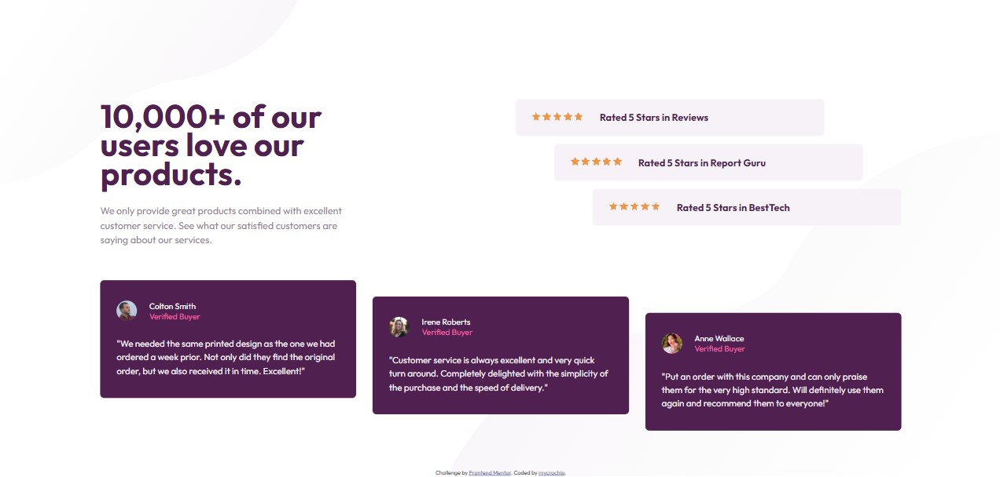

# Frontend Mentor - Social proof section solution

This is a solution to the [Social proof section challenge on Frontend Mentor](https://www.frontendmentor.io/challenges/social-proof-section-6e0qTv_bA). Frontend Mentor challenges help you improve your coding skills by building realistic projects. 

## Table of contents

- [Overview](#overview)
  - [The challenge](#the-challenge)
  - [Screenshot](#screenshot)
  - [Links](#links)
- [My process](#my-process)
  - [Built with](#built-with)
  - [What I learned](#what-i-learned)
  - [Continued development](#continued-development)
  - [Useful resources](#useful-resources)
- [Author](#author)


## Overview

### The challenge

Users should be able to:

- View the optimal layout for the section depending on their device's screen size


### Screenshot

#### Mobile View


#### Desktop View



### Links

- Solution URL: [Add solution URL here](https://your-solution-url.com)
- Live Site URL: [Add live site URL here](https://your-live-site-url.com)


## My process

### Built with

- Semantic HTML5 markup
- CSS custom properties
- Flexbox
- CSS Grid
- Mobile-first workflow


### What I learned

I practiced using components in my html by writing code for only one of duplicate blocks of code and then going on to perfect the styling in css before duplicating the block. (The duplicate blocks ended up requiring only one distinct class)

```html
<!-- Ratings component -->
<section class="ratings">
  <article class="rating rating--1">
    Rated 5 Stars in Reviews
  </article>
</section>

<!-- Cards component -->
<section class="cards">
  <article class="card card--colton">
    <h2 class="card__name" >Colton Smith</h2>
    <p class="card__status" >Verified Buyer</p>
    <p class="card__text">"We needed the same printed design as the one we had ordered a week prior. 
      Not only did they find the original order, but we also received it in time. 
      Excellent!"</p>
  </article>
</section>
```


The following code contains the css used in styling a rating component.
I was particularly proud of the pseudo-element section where I used the background-repeat attribute to get duplicate stars and controlled the number of stars using width.
```css
.ratings,
.cards {
    width: 100%;
    display: flex;
    flex-direction: column;
    margin-bottom: 3rem;
    gap: 1rem;
}

.rating {
    color: var(--clr-primary);
    font-size: 1rem;
    font-weight: 700;
    background-color: var(--clr-pale);
    border-radius: 0.5rem;
    padding-block: 3rem 1rem;
    width: 100%;
    margin: auto;
    position: relative;
}

.rating::after {
    content: "";
    width: 100px;
    height: 20px;
    position: absolute;
    background-image: url(images/icon-star.svg);
    background-repeat: space;
    inset: 1rem 0;
    margin: 0 auto;
}
```


### Continued development

More projects to be completed on [FrotendEnd Mentor](https://www.frontendmentor.io/)


### Useful resources

- [https://css-tricks.com/snippets/css/complete-guide-grid/](https://css-tricks.com/snippets/css/complete-guide-grid/) 
This has always proved to be a useful resource/handbook for me when applying grids to my layout.


## Author

- Frontend Mentor - [@mycrochip](https://www.frontendmentor.io/profile/mycrochip)
- Twitter - [@mycrochip_world](https://www.twitter.com/mycrochip_world)